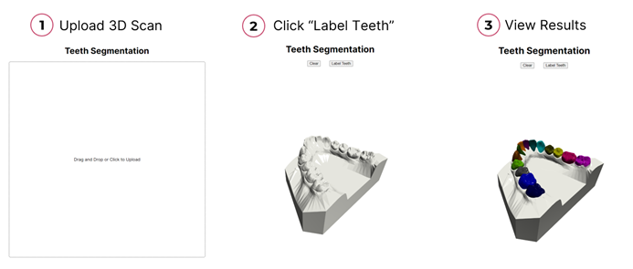

# Teeth Segmentation Models

This repository provides a collection of models for tooth segmentation on 3D intraoral scans.


## Contents

- [Setup](#setup)
- [Models Available](#models-available)
- [Training](#training)
- [Inference](#inference)
- [Reference Codes](#reference-codes)

## Setup

Ensure that [CUDA toolkit](https://developer.nvidia.com/cuda-downloads) version 12.4 is installed on your system. Otherwise, you might see `OSError: CUDA_HOME environment variable is not set. Please set it to your CUDA install root.` as The CUDA toolkit provided by conda is not a complete installation.

On Linux, you may also have to install dependencies for Open3D with:

```bash
apt-get update && apt-get install --no-install-recommends -y \
    libegl1 \
    libgl1 \
    libgomp1
```

After all dependencies are installed, you can create a conda environment with:

```bash
conda env create -f environment.yml
```

## Models Available

- Tooth Group Network
- PointMLP
- Point Transformer
- DGCNN
- PointNet++
- PointNet

## Training

### Dataset

We created a script to download the dataset used by [Tooth Group Network](https://github.com/limhoyeon/ToothGroupNetwork) from [google drive](https://drive.google.com/drive/u/1/folders/15oP0CZM_O_-Bir18VbSM8wRUEzoyLXby).

The directory structure of your data should look like below:

```{}
--base_name_test_fold.txt
--base_name_train_fold.txt
--base_name_val_fold.txt

--data_obj_parent_directory
----00OMSZGW
------00OMSZGW_lower.obj
------00OMSZGW_upper.obj
----0EAKT1CU
------0EAKT1CU_lower.obj
------0EAKT1CU_upper.obj
and so on..

--data_json_parent_directory
----00OMSZGW
------00OMSZGW_lower.json
------00OMSZGW_upper.jsno
----0EAKT1CU
------0EAKT1CU_lower.json
------0EAKT1CU_upper.json
and so on..
```

To use your own data:

- Adhere to the data name format(casename_upper.obj or casename_lower.obj) and file structure.
- All axes must be aligned as shown in the figure below. Note that the Y-axis points towards the back direction(plz note that both lower jaw and upper jaw have the same z-direction!).
  


### Preprocessing

Once the data is downloaded, run the following script to save the sampled points from each mesh:

```bash
python preprocess_data.py
```

Points sampled with farthest point sampling will be saved to `data_preprocessed_path` and points sampled with boundary aware sampling will be saved to `data_bdl_path`.

### Training Script

Start training with the following command:

```bash
python train.py \
  --run_name tgnet_run_1 \
  --model_name tgnet
```

model_name accepts the following values:

- tgnet
- tgnet_bdl
- pointtransformer
- pointmlp
- pointnetpp
- pointnet
- dgcnn

For tooth group network, there are 2 modules that needs to be trained separately. After training the module for farthest point sampling, train the boundary aware sampling module with:

```bash
python train.py \
  --run_name tgnet_bdl_run_1 \
  --model_name tgnet_bdl \
  --input_data_dir data_bdl_path
```

By default, models are trained with the AdamW optimizer for 60 epochs with a weight decay of 1e-4. The learning rate starts at 0.001, then decays to 0 with a cosine schedule. The batch size is 16. These parameters can be changed by running the script with arguments. For a full list of arguments, enter:

```bash
python train.py --help
```

### Provided Checkpoints

- The checkpoints we provided were trained for 60 epochs using the train-validation split provided in the dataset drive link(`base_name_train_fold.txt`, `base_name_val_fold.txt`). The results obtained using the test split(`base_name_test_fold.txt`) are as follows
  
  
  
  (IoU -> Intersection over Union(TSA in challenge) // CLS -> classification accuracy(TIR in challenge)).

- The results may look like this.

  

## Inference

Pretrained checkpoints are available on [Google Drive](https://drive.google.com/drive/folders/15oP0CZM_O_-Bir18VbSM8wRUEzoyLXby?usp=sharing). Download and unzip `ckpts(new).zip`.

### Web Application



Run a web UI made with plotly with:

```bash
python web_app.py
```

By default, the app runs tgnet. But you can choose to use other models:

```bash
python web_app.py \
    --model_name pointtransformer
    --ckpt ckpts/pointtransformer.h5
```

### Provided Scripts

`eval_visualize_results.py` takes a OBJ/STL file and displays the coloured mesh. Optionally, if a label file is provided, metrics would also be printed:

```bash
python eval_visualize_results.py \
    --input_path example.obj \
    --labels_path example.json
```

You can set the model used through parameters:

```bash
python eval_visualize_results.py \
    --input_path example.obj \
    --labels_path example.json \
    --model_name tgnet \
    --ckpt ckpts/tgnet_fps.h5 \
    --ckpt_bdl ckpts/tgnet_bdl.h5
```

### DIY Scripts

If you want to perform teeth segmentation in your own scripts, a pipeline object is provided:

```python
import gen_utils as gu
from inference_pipelines.inference_pipeline_maker import make_inference_pipeline

pipeline = make_inference_pipeline(
    model_name = "tgnet",
    ckpt_path = "ckpts/tgnet_fps.h5",
    bdl_ckpt_path = "ckpts/tgnet_bdl.h5"
)

feats, mesh = gu.load_mesh("input_mesh.obj")
outputs = pipeline(mesh)
mesh = gu.get_colored_mesh(mesh, outputs["sem"])
gu.print_3d(mesh)
```

The inference pipeline takes in either a mesh object or a string containing the path to a OBJ/STL file and returns a dictionary containing the results.

## Reference codes

- https://github.com/LiyaoTang/contrastBoundary.git
- https://github.com/yanx27/Pointnet_Pointnet2_pytorch
- https://github.com/POSTECH-CVLab/point-transformer.git
- https://github.com/fxia22/pointnet.pytorch
- https://github.com/WangYueFt/dgcnn