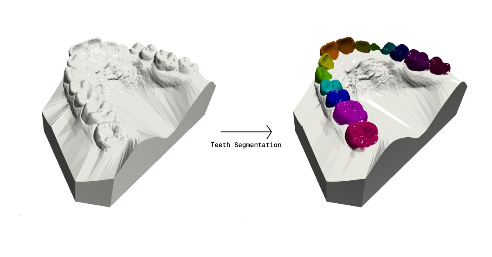

# Teeth Segmentation Models

This repository provides a collection of models for tooth segmentation on 3D intraoral scans.



## Contents

- [Setup](#setup)
- [Models Available](#models-available)
- [Inference with Python](#inference-with-python)
- [Training](#training)

## Setup

Ensure that [CUDA toolkit](https://developer.nvidia.com/cuda-downloads) version 12.4 is installed on your system. Otherwise, you might see `OSError: CUDA_HOME environment variable is not set. Please set it to your CUDA install root.` as The CUDA toolkit provided by conda is not a complete installation.

On Linux, you may also have to install dependencies for Open3D with:

```bash
apt-get update && apt-get install --no-install-recommends -y \
    libegl1 \
    libgl1 \
    libgomp1
```

After all dependencies are installed, you can create a conda environment with:

```bash
conda env create -f environment.yml
```

## Models Available

- Point Transformer
- PointNet++
- PointNet

## Inference with Python

Teeth segmentation can be performed in Python:

```python
import gen_utils as gu
from inference_pipelines.inference_pipeline_maker import make_inference_pipeline

pipeline = make_inference_pipeline(
    model_name = "tgnet",
    ckpt_path = "ckpts/tgnet_fps.h5",
    bdl_ckpt_path = "ckpts/tgnet_bdl.h5"
)

feats, mesh = gu.load_mesh("input_mesh.obj")
outputs = pipeline(mesh)
mesh = gu.get_colored_mesh(mesh, outputs["sem"])
gu.print_3d(mesh)
```

The inference pipeline takes in either a mesh object 

## Training

Start training with the following command:

```bash
python train.py \
  --run_name experiment1 \
  --model_name pointtransformer
```

By default, models are trained with the AdamW optimizer for 60 epochs with a weight decay of 1e-4. The learning rate starts at 0.001, then decays to 0 with a cosine schedule. The batch size is 16.

For a full list of arguments, enter:

```bash
python train.py --help
```

## Dataset

We created a script to download the dataset used by [Tooth Group Network](https://github.com/limhoyeon/ToothGroupNetwork) from [google drive](https://drive.google.com/drive/u/1/folders/15oP0CZM_O_-Bir18VbSM8wRUEzoyLXby).

The directory structure of your data should look like below:

```{}
--base_name_test_fold.txt
--base_name_train_fold.txt
--base_name_val_fold.txt

--data_obj_parent_directory
----00OMSZGW
------00OMSZGW_lower.obj
------00OMSZGW_upper.obj
----0EAKT1CU
------0EAKT1CU_lower.obj
------0EAKT1CU_upper.obj
and so on..

--data_json_parent_directory
----00OMSZGW
------00OMSZGW_lower.json
------00OMSZGW_upper.jsno
----0EAKT1CU
------0EAKT1CU_lower.json
------0EAKT1CU_upper.json
and so on..
```

If you have your dental mesh data, you can use it.

- In such cases, you need to adhere to the data name format(casename_upper.obj or casename_lower.obj).
- All axes must be aligned as shown in the figure below. Note that the Y-axis points towards the back direction(plz note that both lower jaw and upper jaw have the same z-direction!).
  

  
# Training

## Preprocessing

- For training, you have to execute the `preprocess_data.py` to save the farthest point sampled vertices of the mesh (.obj) files.
- Here is an example of how to execute `preprocess_data.py`.

```{bash}
python preprocess_data.py \
--source_obj_data_path data_obj_parent_directory \
--source_json_data_path data_json_parent_directory
```


### 1. tgnet(Ours)

- The tgnet is our 3d tooth segmentation method. Please refer to the [challenge paper]() for an explanation of the methodology.
- You should first train the Farthest Point Sampling model and then train the Boundary Aware Point Sampling model.
- First, train the Farthest Point Sampling model as follows.
  ```
  start_train.py \
   --model_name "tgnet_fps" \
   --config_path "train_configs/tgnet_fps.py" \
   --experiment_name "your_experiment_name" \
   --input_data_dir_path "data_preprocessed_path" \
   --train_data_split_txt_path "base_name_train_fold.txt" \
   --val_data_split_txt_path "base_name_val_fold.txt"
  ```
  - Input the preprocessed data directory path into the `--input_data_dir_path`.
  - You can provide the train/validation split text files through `--train_data_split_txt_path` and `--val_data_split_txt_path`. You can either use the provided text files from the above dataset drive link(`base_name_*_fold.txt`) or create your own text files for the split.
- To train the Boundary Aware Point Sampling model, please modify the following four configurations in `train_configs/tgnet_bdl.py`: `original_data_obj_path`, `original_data_json_path`, `bdl_cache_path`, and `load_ckpt_path`.
  
- After modifying the configurations, train the Boundary Aware Point Sampling model as follows.
  ```
  start_train.py \
   --model_name "tgnet_bdl" \
   --config_path "train_configs/tgnet_bdl.py" \
   --experiment_name "your_experiment_name" \
   --input_data_dir_path "path/to/save/preprocessed_data" \
   --train_data_split_txt_path "base_name_train_fold.txt" \
   --val_data_split_txt_path "base_name_val_fold.txt"
  ```

### 2. tsegnet

- This is the implementation of model . Please refer to the paper for detail.
- First, The centroid prediction module has to be trained first in tsegnet. To train the centroid prediction module, please modify the `run_tooth_seg_mentation_module` parameter to False in the `train_configs/tsegnet.py` file.
  
- And train the centroid prediction module by entering the following command.
  ```
  start_train.py \
   --model_name "tsegnet" \
   --config_path "train_configs/tsegnet.py" \
   --experiment_name "your_experiment_name" \
   --input_data_dir_path "path/to/save/preprocessed_data" \
   --train_data_split_txt_path "base_name_train_fold.txt" \
   --val_data_split_txt_path "base_name_val_fold.txt"
  ```
- Once the training of the centroid prediction module is completed, please update the `pretrained_centroid_model_path` in `train_configs/tsegnet.py` with the checkpoint path of the trained centroid prediction module. Also, set `run_tooth_segmentation_module` to True.
- And please train the tsegnet model by entering the following command.
  ```
  start_train.py \
   --model_name "tsegnet" \
   --config_path "train_configs/tsegnet.py" \
   --experiment_name "your_experiment_name" \
   --input_data_dir_path "path/to/save/preprocessed_data" \
   --train_data_split_txt_path "base_name_train_fold.txt" \
   --val_data_split_txt_path "base_name_val_fold.txt"
  ```


### 3. pointnet | pointnetpp | dgcnn | pointtransformer

- [pointnet](https://arxiv.org/abs/1612.00593) | [pointnet++](http://stanford.edu/~rqi/pointnet2/) | [dgcnn](https://liuziwei7.github.io/projects/DGCNN) | [pointtransformer](https://arxiv.org/abs/2012.09164)
- This model directly applies the point cloud segmentation method to tooth segmentation.
- train models by entering the following command.
  ```
  start_train.py \
   --model_name "pointnet" \
   --config_path "train_configs/pointnet.py" \
   --experiment_name "your_experiment_name" \
   --input_data_dir_path "path/to/save/preprocessed_data" \
   --train_data_split_txt_path "base_name_train_fold.txt" \
   --val_data_split_txt_path "base_name_val_fold.txt"
  ```


# Inference
- To test the performance of the model used in the challenge, please switch to the challenge_branch (refer to the notice at the top).
- We offer six models(tsegnet | tgnet(ours) | pointnet | pointnetpp | dgcnn | pointtransformer).
- All of the checkpoint files for each model are in (https://drive.google.com/drive/folders/15oP0CZM_O_-Bir18VbSM8wRUEzoyLXby?usp=sharing). Download ckpts(new).zip and unzip all of the checkpoints.
- Inference with tsegnet / pointnet / pointnetpp / dgcnn / pointtransformer
  ```
  python start_inference.py \
   --input_dir_path obj/file/parent/path \
   --split_txt_path base_name_test_fold.txt \
   --save_path path/to/save/results \
   --model_name tgnet_fps \
   --checkpoint_path your/model/checkpoint/path
  ```
- Inference with tgnet(ours)

```
python start_inference.py \
  --input_dir_path obj/file/parent/path \
  --split_txt_path base_name_test_fold.txt \
  --save_path path/to/save/results \
  --model_name tgnet_fps \
  --checkpoint_path your/tgnet_fps/checkpoint/path
  --checkpoint_path_bdl your/tgnet_bdl/checkpoint/path
```

- Please input the parent path of the original mesh obj files instead of the preprocessed sampling points in `--input_data_dir_path` for training. The inference process will handle the farthest point sampling internally.
- For `split_txt_path`, provide the test split fold's casenames in the same format as used during training.
- Predicted results are saved in save_path like below... It has the same format as the ground truth json file.

```
--save_path
----00OMSZGW_lower.json
----00OMSZGW_upper.json
----0EAKT1CU_lower.json
----0EAKT1CU_upper.json
and so on...
```

- the inference config in "inference_pipelines.infenrece_pipeline_maker.py" has to be the same as the model of the train config. If you change the train config, then you have to change the inference config.

# Test results

- The checkpoints we provided were trained for 60 epochs using the train-validation split provided in the dataset drive link(`base_name_train_fold.txt`, `base_name_val_fold.txt`). The results obtained using the test split(`base_name_test_fold.txt`) are as follows
  
  
  
  (IoU -> Intersection over Union(TSA in challenge) // CLS -> classification accuracy(TIR in challenge)).

- The results may look like this.

  

# Evaulation & Visualization

- We provide the evaluation and visualization code.
- You can execute the following code to test on a pair of obj/gt json file:

```
eval_visualize_results.py \
  --mesh_path path/to/obj_file \ 
  --gt_json_path path/to/gt_json_file \
  --pred_json_path path/to/predicted_json_file(a result of inference code)
```

- With just a few modifications to the provided code, you can write code to test all the results.

# Installation

- Installtion is tested on pytorch/pytorch:1.7.1-cuda11.0-cudnn8-devel(ubuntu, pytorch 1.7.1) docker image.
- It can be installed on other OS(window, etc..)
- There are some issues with RTX40XX graphic cards. plz report in issue board.
- if you have any issues while installing pointops library, please install another pointops library source in (https://github.com/POSTECH-CVLab/point-transformer).

```{bash}
pip install -r requirements.txt
```

# Reference codes

- https://github.com/LiyaoTang/contrastBoundary.git
- https://github.com/yanx27/Pointnet_Pointnet2_pytorch
- https://github.com/POSTECH-CVLab/point-transformer.git
- https://github.com/fxia22/pointnet.pytorch
- https://github.com/WangYueFt/dgcnn